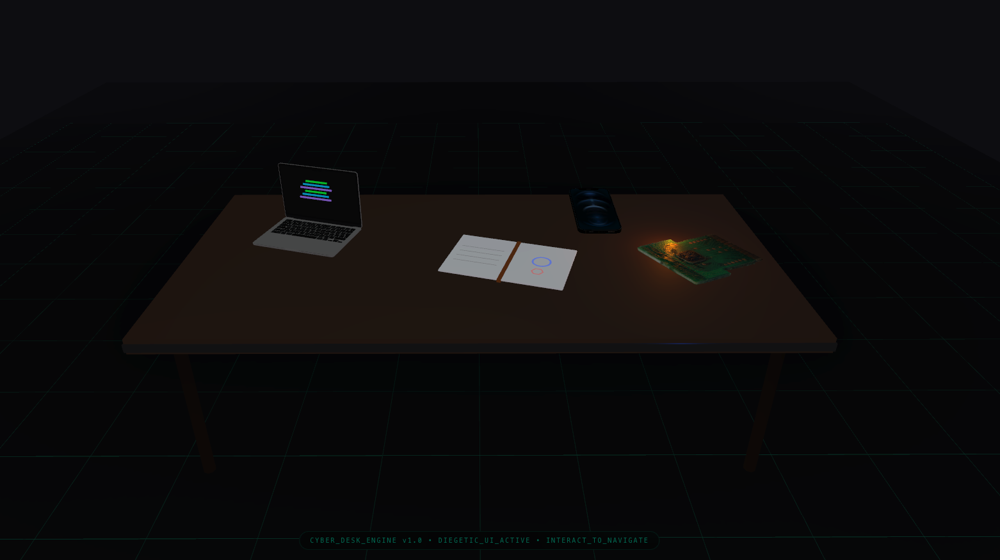

# 🚀 Cyber Desk - 3D Mechatronics Workbench

A cutting-edge interactive 3D visualization platform built with **Next.js** and **React Three Fiber**, designed to showcase immersive diegetic UI experiences. Cyber Desk transforms complex digital environments into fluid, responsive 3D workspaces with real-time interactions.



## ✨ Features

- **Interactive 3D Rendering** - Powered by Three.js with advanced post-processing effects
- **Diegetic UI Design** - Seamless integration of user interface within the 3D environment
- **Multiple 3D Models** - Pre-loaded assets including devices and components
  - 📱 iPhone model
  - 💻 Mac model  
  - 🔌 PCB (Printed Circuit Board) model
- **Real-time Control** - OrbitControls for intuitive camera manipulation
- **Performance Optimized** - Bloom effects, rounded geometries, and efficient asset loading
- **Modern Tech Stack** - Built with Next.js 16, React 19, and TypeScript

## 🛠️ Tech Stack

| Technology | Purpose |
|-----------|---------|
| **Next.js 16** | React framework for production |
| **React 19** | UI library |
| **Three.js** | 3D graphics engine |
| **React Three Fiber** | React renderer for Three.js |
| **React Three Drei** | Useful helpers for R3F |
| **Tailwind CSS** | Utility-first CSS framework |
| **TypeScript** | Type-safe JavaScript |

## 📦 3D Assets

The project includes interactive 3D models located in `public/models/`:

```
public/models/
├── iphone.glb        # iPhone device model
├── mac.glb           # Mac computer model
└── pcb.glb           # Circuit board component
```

These models are loaded using `useGLTF` from React Three Drei and rendered in real-time.

## 🚀 Getting Started

### Prerequisites

- **Node.js** 18+
- **npm** or **yarn** package manager

### Installation

1. Clone the repository:
```bash
git clone https://github.com/SuhanArda/cyber-desk.git
cd cyber-desk/cyber-desk-ui
```

2. Install dependencies:
```bash
npm install
# or
yarn install
# or
pnpm install
```

### Development Server

Run the development server:

```bash
npm run dev
```

Open [http://localhost:3000](http://localhost:3000) in your browser to see the interactive 3D scene. The application auto-reloads as you edit files.

## 📝 Project Structure

```
cyber-desk-ui/
├── app/
│   ├── layout.tsx          # Root layout
│   ├── page.tsx            # Main 3D scene component
│   └── globals.css         # Global styles
├── public/
│   ├── models/             # 3D model assets (GLB files)
│   └── icons/              # SVG icons
├── package.json            # Dependencies
├── tsconfig.json           # TypeScript configuration
├── tailwind.config.ts      # Tailwind CSS configuration
└── next.config.ts          # Next.js configuration
```

## 🎮 Interactive Controls

- **Rotate** - Drag to rotate the 3D scene
- **Zoom** - Scroll wheel to zoom in/out
- **Pan** - Right-click and drag to pan the camera

## 🏗️ Build & Deployment

### Build for Production

```bash
npm run build
npm start
```

### Deploy on Vercel

The easiest way to deploy is using [Vercel](https://vercel.com), the creators of Next.js:

```bash
vercel deploy
```

Or connect your GitHub repository to Vercel for automatic deployments.

## 🎨 Customization

### 3D Scene

Edit `app/page.tsx` to modify:
- 3D model positions and rotations
- Lighting and post-processing effects
- UI overlays and interactions

### Styles

Modify `app/globals.css` and use Tailwind CSS classes for styling.

## 📚 Learning Resources

- [Next.js Documentation](https://nextjs.org/docs)
- [Three.js Documentation](https://threejs.org/docs)
- [React Three Fiber Docs](https://docs.pmnd.rs/react-three-fiber/getting-started/introduction)
- [Tailwind CSS](https://tailwindcss.com/docs)

## 🤝 Contributing

Contributions are welcome! Please feel free to submit issues and pull requests.

## 📄 License

This project is open source and available under the MIT License.

## 👨‍💻 Author

Created by [Suhan Arda](https://github.com/SuhanArda)

---
